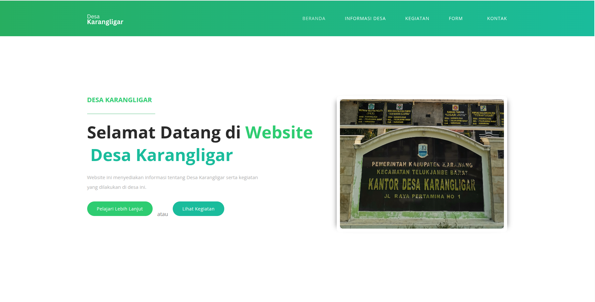
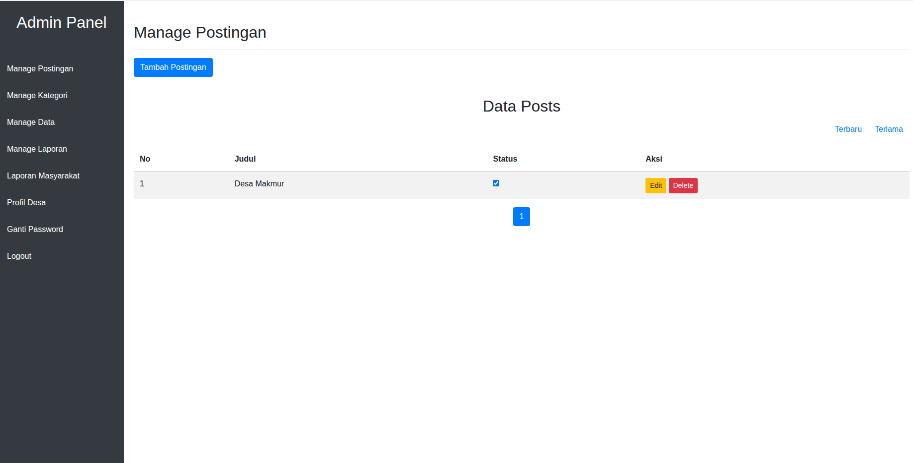

# 🌾 Website Desa KKN Karangligar

> Platform digital desa berbasis web untuk mendukung pelayanan publik, informasi warga, dan administrasi desa secara modern dan efisien.


---

## 📸 Screenshot



```

---

## ✨ Fitur Utama

### 🏠 Halaman Publik
- **Beranda** — Menampilkan postingan/berita terbaru desa, data informasi, dan laporan
- **Profil Desa** — Informasi lengkap desa termasuk kepala desa dan lokasi kantor
- **Blog & Berita** — Artikel dan informasi kegiatan desa
- **Informasi Warga** — Data warga dalam format tabel dengan fitur pencarian & filter
- **Layanan Surat** — Form pengajuan surat online dengan generate PDF otomatis

### 🔐 Panel Admin
- **Dashboard Admin** — Manajemen seluruh konten website
- **Manajemen Postingan** — Tambah, edit, hapus berita/postingan desa
- **Manajemen Surat** — Kelola template surat dan hasil pengajuan
- **Manajemen Data** — Upload dan kelola data warga (CSV/Excel)
- **Laporan PDF** — Lihat dan kelola semua surat yang telah digenerate
- **Ganti Password** — Keamanan akun admin

---

## 🛠️ Tech Stack

| Komponen | Teknologi |
|----------|-----------|
| Backend | Python + Flask |
| Database | MySQL (via XAMPP) |
| Frontend | HTML, CSS, JavaScript |
| PDF Generator | PyMuPDF (fitz) |
| Data Processing | Pandas |
| Auth | Session + MD5 Hashing |

---

## ⚙️ Instalasi & Menjalankan Project

### Prasyarat
- Python 3.10+
- XAMPP (Apache + MySQL)
- pip

### 1. Clone Repository
```bash
git clone https://github.com/vikhatrivicika/kkn_karangligar.git
cd kkn_karangligar
```

### 2. Install Dependencies
```bash
pip install -r requirements.txt
```

### 3. Konfigurasi Environment
```bash
cp .env.example .env
```

Edit file `.env` sesuai konfigurasi lokal kamu:
```env
SECRET_KEY=your_secret_key
DB_HOST=127.0.0.1
DB_USER=root
DB_PASSWORD=
DB_NAME=kkn_karangligar
```

### 4. Setup Database
- Jalankan XAMPP (Apache + MySQL)
- Buka phpMyAdmin: `http://localhost/phpmyadmin`
- Buat database baru bernama `kkn_karangligar`
- Import file SQL: `kkn_karangligar.sql`

### 5. Jalankan Aplikasi
```bash
python3 app.py
```

Buka di browser: `http://127.0.0.1:5000`

---

## 📁 Struktur Folder

```
kkn_karangligar/
├── app.py                  # Main Flask application
├── .env.example            # Contoh konfigurasi environment
├── .gitignore
├── requirements.txt
├── static/                 # CSS, JS, Images
├── templates/              # HTML templates
│   └── admin/              # Template halaman admin
└── uploads/                # File upload (tidak diikutkan ke repo)
    ├── templates/          # Template PDF surat
    ├── hasil/              # Hasil generate PDF
    ├── data/               # File data warga (CSV/Excel)
    ├── post_thumbnails/    # Thumbnail postingan
    └── profil/             # Foto profil desa
```

---

## 👨‍💻 Developer

Dibuat sebagai bagian dari program **Kuliah Kerja Nyata (KKN)** di Desa Karangligar.

> Dikembangkan dengan ❤️ menggunakan Python & Flask

---

## 📄 License

Project ini bersifat open source dan dibuat untuk keperluan pengabdian masyarakat.
